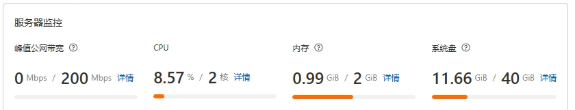

最近用向日葵远程电脑时，我越来越受不了它的延迟：画面更新慢、操作有明显的黏滞感，网络稍有波动就更难受。单纯换一个远程桌面客户端并不能解决所有问题，真正影响体验的还有连接路径——只要流量绕得足够远，再好的客户端也救不回来。

我由此想起了以前开《方舟：生存进化》和 Minecraft 服务器时留下的两套工具：EasyTier 和 Sakura Frp。当时为了让不同网络下的朋友加入服务器，我没少折腾 P2P 打洞、端口映射和中转节点。这次干脆把旧方案重新组合，看看能不能搭一套延迟更低、路径更可控的远程桌面环境。

## 从游戏联机方案想到远程桌面

国内家庭宽带普遍没有可直接入站的独立公网 IPv4，不少线路还处于运营商 CGNAT 后面。EasyTier 会优先尝试 NAT 穿透，但两端 NAT 类型、运营商策略或防火墙不合适时，P2P 连接仍然可能失败。

我最早采用的办法是：

1. 在一台没有公网 IP 的设备上运行 EasyTier，让它监听本地端口。
2. 使用 Sakura Frp 把 EasyTier 的监听端口映射到一个公网节点。
3. 其他设备通过 Sakura Frp 节点提供的域名和端口加入 EasyTier 网络。
4. EasyTier 能打洞时尽量走 P2P；打洞失败时，通过指定的中转路径保持可用。

这套方案的关键不是“消灭延迟”，而是把不可控的绕路收敛到一个位置合适的中转节点。最终延迟仍取决于中转机房、双方运营商线路、网络拥塞和丢包率，但通常会比随机分配、路径不可控的公共远控服务稳定。

后来我准备把同一思路用到 RustDesk 上：先用 EasyTier 建立虚拟局域网，再把自建的 RustDesk ID 服务和中继服务放进这个网络。结果看 Sakura Frp 套餐时，发现当时最低的青铜 VIP 也要 10 元/月。价格可能随时调整，但这已经足够让我继续逛一圈云服务器。

然后我碰到了这台小机器：2 核 CPU、2 GiB 内存、40 GiB 系统盘，峰值公网带宽 200 Mbps，还带独立公网 IP。价格只要 68 元，于是直接开干。



需要注意，页面标注的是**峰值公网带宽**，不等于任何时刻都能稳定跑满 200 Mbps。实际吞吐还会受实例限速、共享出口、线路质量和流量配额影响。对远程桌面来说，稳定延迟和低丢包通常比峰值数字更重要。

## 最终方案

这台服务器同时承担两个职责：

- **EasyTier 固定节点**：所有设备先加入同一个加密虚拟网络；能直连时走 P2P，不能直连时由服务器协助转发。
- **RustDesk 服务端**：运行 `hbbs`（ID/信令服务）和 `hbbr`（中继服务），远控双方通过 EasyTier 虚拟 IP 访问它们。

```text
远控端 ─┐
        ├─ EasyTier 虚拟网络 ─ 阿里云服务器（10.144.144.1）
被控端 ─┘                         ├─ hbbs：ID/信令
                                 └─ hbbr：远程桌面中继
```

这样做有两个好处：

1. 公网侧原则上只需要开放 EasyTier 的入口，RustDesk 端口可以只允许虚拟网段访问。
2. 如果将来更换云服务器，只要保留 EasyTier 网段、RustDesk 数据目录和公钥，客户端配置基本不需要重做。

下面以 Debian/Ubuntu 系统和 Docker Compose 为例。命令中的网络名称、密码、公网 IP 都必须替换为自己的值，**不要把真实密码、Sakura Frp 访问密钥或 RustDesk 私钥写进公开文章**。

## 一、准备服务器

先更新系统并安装 Docker。Docker 的安装方式会随发行版变化，建议直接参考 [Docker 官方安装文档](https://docs.docker.com/engine/install/)，不要长期依赖来历不明的一键脚本。

确认 Docker 和 Compose 可用：

```bash
docker --version
docker compose version
```

在阿里云安全组中开放：

| 端口 | 协议 | 用途 |
| --- | --- | --- |
| `11010` | TCP | EasyTier 节点连接 |
| `11010` | UDP | EasyTier UDP 连接和更低延迟的直连尝试 |

如果只准备通过 EasyTier 虚拟网络使用 RustDesk，就不需要在云安全组中公开 `21115`—`21117`。若服务器启用了 UFW，可以先放行 EasyTier：

```bash
sudo ufw allow 11010/tcp
sudo ufw allow 11010/udp
```

安全组对外开放时无法限制动态家庭宽带的来源地址，因此一定要使用足够长且随机的 EasyTier 网络密码。

## 二、部署 EasyTier

创建工作目录：

```bash
sudo mkdir -p /opt/easytier
cd /opt/easytier
sudo nano compose.yml
```

写入以下配置：

```yaml
services:
  easytier:
    image: easytier/easytier:latest
    hostname: aliyun-relay
    container_name: easytier
    restart: unless-stopped
    network_mode: host
    cap_add:
      - NET_ADMIN
      - NET_RAW
    devices:
      - /dev/net/tun:/dev/net/tun
    volumes:
      - /etc/machine-id:/etc/machine-id:ro
    command: >
      -i 10.144.144.1
      --network-name YOUR_NETWORK_NAME
      --network-secret YOUR_STRONG_SECRET
      --private-mode true
```

这里的参数含义：

- `-i 10.144.144.1`：给服务器分配固定的 EasyTier 虚拟 IP。
- `--network-name`：虚拟网络名称，所有设备必须一致。
- `--network-secret`：虚拟网络密码，所有设备必须一致。
- `--private-mode true`：只允许网络名称和密码匹配的节点加入。
- `network_mode: host`：让容器直接使用宿主机网络。
- `/dev/net/tun`、`NET_ADMIN` 和 `NET_RAW`：创建虚拟网卡所需的权限。

启动服务：

```bash
sudo docker compose up -d
sudo docker compose logs -f easytier
```

首次验证完成后，建议把 `latest` 换成当时确认可用的具体版本，避免未来自动拉取到不兼容更新。

## 三、让电脑加入 EasyTier 网络

在远控端和被控端安装 EasyTier。官方提供 Windows、Linux、macOS 等平台的 GUI 和命令行版本，本文只展示命令行参数。

被控端可以使用固定虚拟 IP：

```bash
sudo easytier-core \
  -i 10.144.144.2 \
  --network-name YOUR_NETWORK_NAME \
  --network-secret YOUR_STRONG_SECRET \
  -p tcp://SERVER_PUBLIC_IP:11010 \
  -p udp://SERVER_PUBLIC_IP:11010
```

远控端使用另一个地址：

```bash
sudo easytier-core \
  -i 10.144.144.3 \
  --network-name YOUR_NETWORK_NAME \
  --network-secret YOUR_STRONG_SECRET \
  -p tcp://SERVER_PUBLIC_IP:11010 \
  -p udp://SERVER_PUBLIC_IP:11010
```

Windows 下使用 `easytier-core.exe`，并以管理员身份启动终端。GUI 用户填写相同的网络名称、网络密码、虚拟 IP 和对等节点地址即可。

检查组网状态：

```bash
easytier-cli peer
easytier-cli route
ping 10.144.144.1
```

`peer` 输出中的 `tunnel_proto`、`lat_ms` 和 `loss_rate` 很重要：

- `p2p` 或直连路径通常延迟最低。
- 通过服务器转发时，延迟大致由“本地到服务器”和“服务器到对端”两段路径共同决定。
- 丢包明显时，不要只盯着平均延迟；远程桌面的卡顿往往先由抖动和丢包触发。

## 四、部署 RustDesk Server OSS

在服务器上创建 RustDesk 工作目录：

```bash
sudo mkdir -p /opt/rustdesk/data
cd /opt/rustdesk
sudo nano compose.yml
```

写入：

```yaml
services:
  hbbs:
    image: rustdesk/rustdesk-server:latest
    container_name: hbbs
    command: hbbs -r 10.144.144.1:21117
    volumes:
      - ./data:/root
    network_mode: host
    depends_on:
      - hbbr
    restart: unless-stopped

  hbbr:
    image: rustdesk/rustdesk-server:latest
    container_name: hbbr
    command: hbbr
    volumes:
      - ./data:/root
    network_mode: host
    restart: unless-stopped
```

其中：

- `hbbs` 默认使用 `21116` 提供 ID 注册和连接服务，并使用 `21115/TCP` 进行 NAT 类型测试。
- `hbbr` 默认使用 `21117/TCP` 提供中继服务。
- `-r 10.144.144.1:21117` 明确告诉客户端中继服务位于服务器的 EasyTier 虚拟 IP。
- `./data:/root` 用于持久化服务器密钥和数据库，迁移或备份时不能漏掉。

启动：

```bash
sudo docker compose up -d
sudo docker compose ps
sudo docker compose logs --tail=100 hbbs hbbr
```

读取 RustDesk 公钥：

```bash
sudo cat /opt/rustdesk/data/id_ed25519.pub
```

`id_ed25519.pub` 可以填写到客户端；同目录下的私钥绝不能公开。

如果使用 UFW，并且只允许 EasyTier 网段访问 RustDesk：

```bash
sudo ufw allow from 10.144.144.0/24 to any port 21115:21117 proto tcp
sudo ufw allow from 10.144.144.0/24 to any port 21116 proto udp
```

云安全组仍然只开放 `11010/TCP` 和 `11010/UDP`。RustDesk 官方还列出了 `21118`、`21119` 两个 Web 客户端端口；本文不使用 Web 客户端，因此保持关闭。

## 五、配置 RustDesk 客户端

远控端和被控端都要先接入 EasyTier，并确认能够访问 `10.144.144.1`。然后打开 RustDesk：

1. 进入“设置”→“网络”。
2. 解锁网络设置。
3. `ID Server` 填写 `10.144.144.1:21116`。
4. `Relay Server` 填写 `10.144.144.1:21117`。
5. `Key` 填写 `id_ed25519.pub` 的完整内容。
6. `API Server` 留空；开源版不需要它。
7. 保存后检查客户端底部是否显示“就绪”。

RustDesk 官方说明中继地址通常可以由客户端推断，但这里显式填写，方便确认所有流量都使用预期的 EasyTier 地址。

接下来使用另一台设备的 RustDesk ID 发起连接。测试时同时观察：

```bash
easytier-cli peer
sudo docker compose -f /opt/rustdesk/compose.yml logs -f hbbs hbbr
```

如果 RustDesk 日志显示使用了 `hbbr`，说明本次连接经过 RustDesk 中继；如果双方建立了直连，则服务器主要负责 ID 和连接协调。

## 六、没有公网 IP 时，用 Sakura Frp 暴露 EasyTier

如果没有这台带独立公网 IP 的服务器，原来的 Sakura Frp 方案仍然能用，而且没有必要把 RustDesk 的每个端口都单独映射出去。只暴露 EasyTier 入口，再让 RustDesk 走虚拟网络即可。

在 Sakura Frp 面板中创建 TCP 隧道：

| 配置项 | 值 |
| --- | --- |
| 隧道类型 | TCP |
| 本地 IP | `127.0.0.1` |
| 本地端口 | `11010` |
| 节点 | 优先选择距离双方近、跨网表现稳定的节点 |
| 远程端口 | 使用平台分配或允许设置的端口 |

在运行 EasyTier 固定节点的设备上启动 Sakura Frp 客户端。可以使用官方启动器，也可以按面板给出的隧道 ID 启动：

```bash
./frpc -f 'YOUR_ACCESS_TOKEN:YOUR_TUNNEL_ID'
```

其他设备把 EasyTier 的对等节点地址改为：

```bash
easytier-core \
  -i 10.144.144.2 \
  --network-name YOUR_NETWORK_NAME \
  --network-secret YOUR_STRONG_SECRET \
  -p tcp://SAKURA_NODE_HOST:REMOTE_PORT
```

需要尝试 UDP 时，再单独创建一条指向本地 `11010/UDP` 的 UDP 隧道，并增加一个 `udp://` 对等节点地址。TCP 路径通常更容易建立，但遇到丢包时可能产生队头阻塞；UDP 的实时性可能更好，实际效果必须按线路测试。

Sakura Frp 的“端口导出”功能还会尝试 NAT 打洞，但官方文档也明确提示：NAT 类型不合适时很可能不可用。它可以作为优化项，不能代替稳定的中转路径。

## 七、延迟不理想时怎么排查

### 1. 先测基础网络

```bash
ping SERVER_PUBLIC_IP
ping 10.144.144.1
```

比较公网 IP 和 EasyTier 虚拟 IP 的延迟与丢包。如果虚拟网络明显更差，先检查 EasyTier 实际选择的协议和路径。

### 2. 确认是否发生了双重中转

最差的情况可能是：

```text
远控端 → EasyTier 中转 → 被控端 → RustDesk 中继 → 远控端
```

EasyTier 和 RustDesk 都可能在直连失败时启用中继。先通过 `easytier-cli peer` 判断 EasyTier 是否直连，再看 `hbbr` 日志确认 RustDesk 是否使用中继。能直连时不要强制所有流量经过 `hbbr`。

### 3. 选择更合适的节点地域

中转服务器不一定离其中一方越近越好。双方跨运营商时，应分别测试到服务器的延迟、抖动和晚高峰丢包，选择总路径更均衡的地域。

### 4. 调整 RustDesk 画质

网络路径优化后，编码参数仍会影响体验。弱网下适当降低分辨率、帧率和图像质量，往往比盲目追求高码率更稳定。

### 5. 检查服务器资源和流量

```bash
docker stats
ip -s link
df -h
```

2 核 2 GiB 对少量个人连接通常够用，但同时中继多路高分辨率画面时，带宽、CPU 和流量配额都可能成为瓶颈。

## 八、安全和维护

- EasyTier 网络名称不要使用常见词，网络密码使用随机长字符串。
- 不要公开 Sakura Frp 访问密钥、隧道 ID、RustDesk 私钥或真实服务器管理端口。
- RustDesk 的 `id_ed25519.pub` 是公钥，可以分发；`id_ed25519` 是私钥，必须妥善备份并限制权限。
- 不使用 RustDesk Web 客户端时，不开放 `21118` 和 `21119`。
- 定期备份 `/opt/rustdesk/data` 和两份 Compose 配置。
- 升级前记录当前镜像版本，先拉取镜像并查看变更，再执行 `docker compose up -d`。
- 云服务器有独立公网 IP 不代表所有端口都应该暴露；能只通过 EasyTier 访问的服务，就不要直接开放到公网。

## 最后

这次折腾的起点只是“向日葵太卡了”，最后却把以前为游戏联机准备的 EasyTier、Sakura Frp 和现在的 RustDesk 串成了一套完整方案。

没有公网 IP 时，Sakura Frp 可以帮助暴露 EasyTier 入口；有独立公网 IP 后，云服务器可以直接成为固定组网节点，同时承载 RustDesk 的 ID 和中继服务。整个方案并不能保证任何网络下都获得最低延迟，但它把连接路径、服务器位置和带宽控制权拿回了自己手里，后续出现问题也有明确的排查方向。

## 参考资料

- [EasyTier：安装命令行程序](https://easytier.cn/guide/installation.html)
- [EasyTier：快速组网](https://easytier.cn/guide/network/quick-networking.html)
- [EasyTier：搭建共享节点](https://easytier.cn/guide/network/host-public-server.html)
- [RustDesk Server OSS：Docker 部署](https://rustdesk.com/docs/en/self-host/rustdesk-server-oss/docker/)
- [RustDesk：客户端配置](https://rustdesk.com/docs/en/self-host/client-configuration/)
- [Sakura Frp：端口导出](https://doc.natfrp.com/frpc/export-port.html)
- [Sakura Frp：frpc 用户手册](https://doc.natfrp.com/frpc/manual.html)
